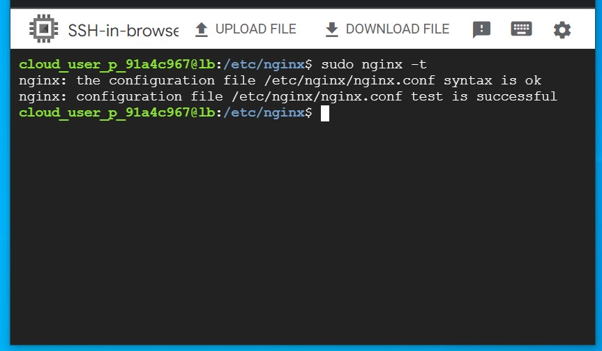
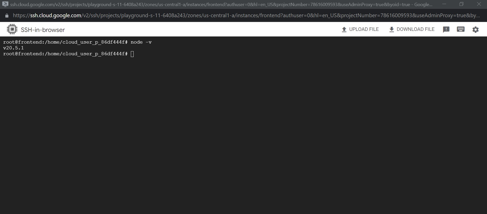
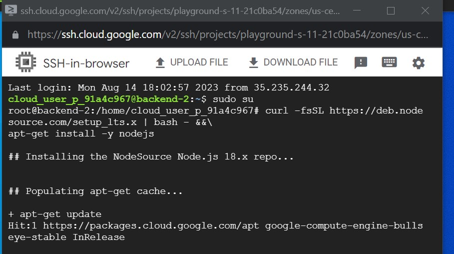

[](#)

# GCP demo: Full stack Deployment on GCP

The repo shows how to set up a full-stack VPC (Virtual Private ☁️) deployment on Google Cloud Platform (GCP 🚀) and use Nginx as a reverse proxy and load balancer.  in this demonstration, we'll use a single VPC, each hosting server connecting in the same VPC.
 we will connect the vpc according to the following diagram (figure-1).

<br/>
<figure>
<figcaption align = "center">Fig.1 - A schematic representation of the demo</figcaption></figure>
<br/>

the following table is a summary of the services that will be created in this demonstration. Throughout the tutorial, we'll refer to this table.

<br/>
<h3 align="center"> Table 1 - A summary of the services in GCP</h3>

| sl |  VPC Name | VPC Location |  VPC Subnet Name |  IPv4 Network  |  VM Name | VM IP Address | Container name | Exposed Port |
|:--:|:---------:|:------------:|:----------------:|:--------------:|:--------:|:-------------:|:--------------:|:------------:|
|  1 | class-vpc  |   us central1   |  class-vpc-subnet  |  192.168.0.0/24 |  LB  |   192.168.0.2   |       LB      |     80     |

<br/>

> **Note**
> If you're following along, throughout the demonstration, unless otherwise mentioned, keep every settings as default while creating any 
services in Google Cloud Platform (GCP) for the purpose of reproducibility.

<br/>

### Creating VPC in GCP

Let's start by creating our VPC. To create a VPC you need to do the following step:- Go to the `VPC network` from the menu and select `VPC networks` followed by `Create VPC network`. Now, we need to provide a name for the VPC. After that, we'll create a new subnet, providing the name of the subnet, region, and IPv4 range in CIDR notation. We'll allow the default firewall rules and click on the create button to finish off the VPC creation process.

The step-by-step process for creating each VPC is shown below,

<details>
<summary>Creating <code>vpc</code></summary><br/>


</details>


<br/>

### Creating VM in GCP

Once we're done with creating VPC, we'll start creating our servers (VM). To create VM, go to `Compute Engine` from the menu, select `VM Instances` followed by `Create Instance`. We'll provide a name, select a region and stick to the default zone of that region. Then go to `Networking` settings of the `Advanced options`. Now, specify a new network interface by selecting a network and a subnetwork. Here, we'll create a 5 VM for each VPC namely `Loadbalance`, `frontend `,`backend`, and `db`. The region will be the same as the corresponding VPC of each VM. The network and subnetwork will be the name of the VPC and its subnet for each VM respectively. We'll complete the process by clicking on the create button.

<br/>

The step-by-step process for creating each VM is shown below,

<details>
<summary>Creating Loadbalance</summary><br/>


</details>

<details>
<summary>Creating Frontend</summary><br/>


</details>

<details>
<summary>Creating Backend </summary><br/>


</details>
<summary>Creating Database </summary><br/>


</details>

<br/>

<!--  -->
<details>
<summary>Connecting <code>cloud Nat </code> and <code>Router</code></summary>
<br/>


</details>

### Ping the server!

Now, we can test the connection between the VPC using `ping` command which sends an ICMP ECHO_REQUEST to network hosts. To test the connection we'll require the IP address of the servers within each VPC. We can see obtain that by going to the `VM Instances` panel in the `Compute Engine` option from the menu. Once we obtain the IP address, we can ssh into each server and use `ping` to test the connection with another server that is in the peered network of that VPC. Here, first, we'll ssh into the `vm-proxy`, and type `ping <IP_OF_DESTINATION_SERVER>` in the command line to connect with the `vm-db` server. We'll repeat the process for `loadbalance` to `Frontend`, `Backend` to `loadbalance` and `Backend` to `Frontend` to test those connections. If a connection gets established, it will log statistics in the cli.

<details>
<summary>Testing with <code>ping</code></summary><br/>


</details>
<br/>
###  Install nginx on VM
<details>
<summary>Install <code>nginx on VM </code></summary><br/>




</details>
<br/>
<details>
<summary>Install <code>Nodejs on frontend </code></summary><br/>





</details>
<br/>
### Using Debian, as root
```
    curl -fsSL https://deb.nodesource.com/setup_16.x | bash - &&\
    apt-get install -y nodejs
```
### Service Container Setup

```
   sudo su

    yarn add express

```
npm Install
```
    sudo corepack enable
    npm init -y
```
### frontend setup
```
 sudo corepack enable
 yarn -v
 yarn create vite
 yarn
 yarn run build
 yarn preview
 sudo yarn preview --host --port 80


```
### Backend Install in Nodejs and express
<details>
<summary>Install <code>nodejs and express on VM </code></summary><br/>



</details>
<br/>

### Testing the Api
<details>
<summary>Result of Testing the api</summary><br/>


</details>
<br/>

Install Command


